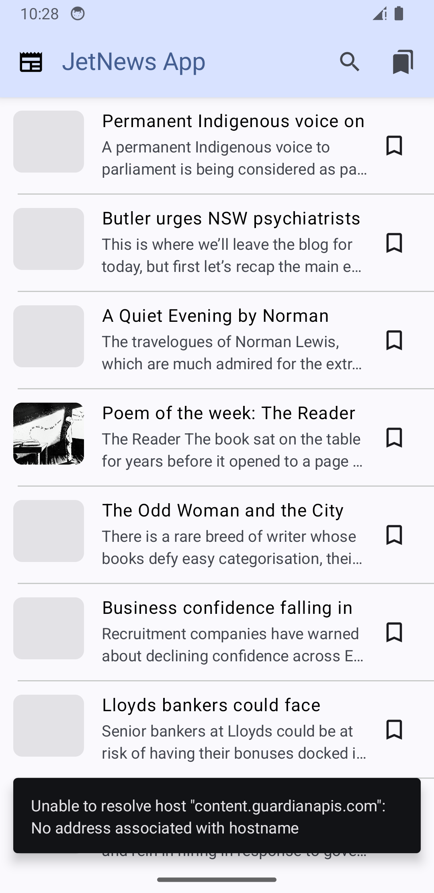

# JetpackComposeNewsApp

## Overview

**_JetpackComposeNewsApp_** is an Android application that allows users to fetch and read latest news articles from [Guardian News API](https://open-platform.theguardian.com/access/). The App is architected using MVVM clean architecture and the code is fully written with kotlin programming language. The Ui stack is implemented with Jetpack Compose using material3 components.

## Features

- Fetch and display News Headline Articles on a List screen
- Display extended Article content on a detail screen 
- Search specific Articles with a given query
- Supports Offline caching
- Interactive Error Handling
- Supports Dark/Light mode

## Screenshots

<table>
  <tr>
    <td></td>
    <td></td>
    <td></td>
    <td></td>
    <td></td>
    <td></td>
    <td></td>
    <td></td>
  </tr>
</table>

## Considered Technical stacks

- SOLID Principles
- MVVM Clean Architecture
- Layered modularization
- Dependency Injection with Dagger-Hilt
- Ui component construction with Jetpack Compose framework and Material3
- Use of kotlin flow to handle async data over coroutines
- Partial unit test with mockito

## Architecture

In order to fully achieve the proper separation of concerns, it's been decided to follow the MVVM clean architecture design and principles.

The App is modularized into 3 modules named:
- `:app` (Presentation Layer): Responsible to handle Ui construction and interaction
- `:news-business` (Domain Layer): Responsible to handle business logic and delegate data from the data layers
- `:news-data` (Data Layer): Responsible to provide data from different sources (Remote or Local)

### Included Library

- Kotlin + DSL
- Coroutines
- Flow
- Dagger-Hilt
- Retrofit
- Jetpack Compose
- Navigation
- Etc.

### Testing

Partial classes of certain modules have been tested with Mockito but requires time to extend coverage

### Future Improvement

- Add more Unit/Ui test
- Support add/remove bookmark feature
- Complete Bookmark list screen
